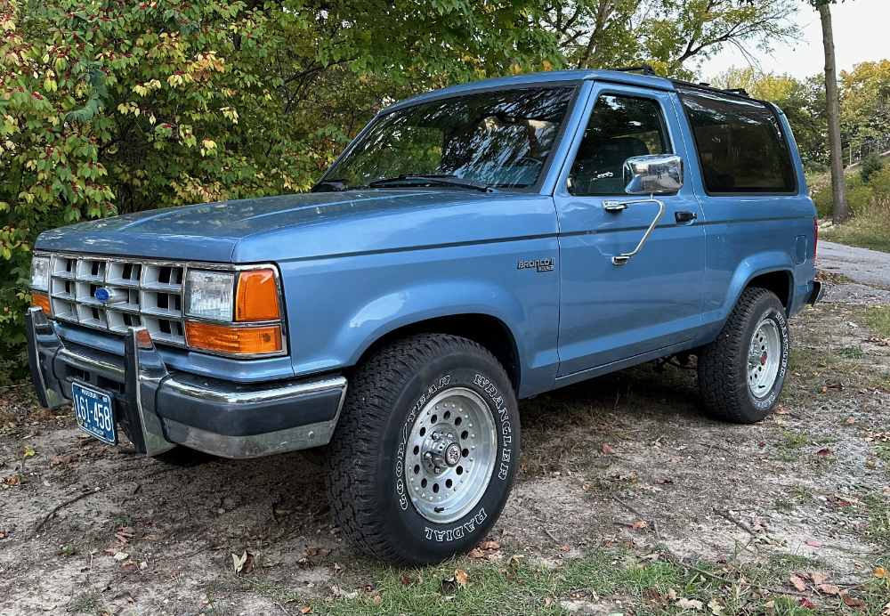
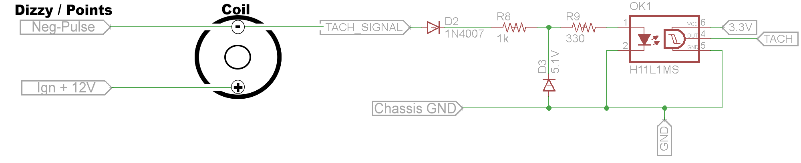
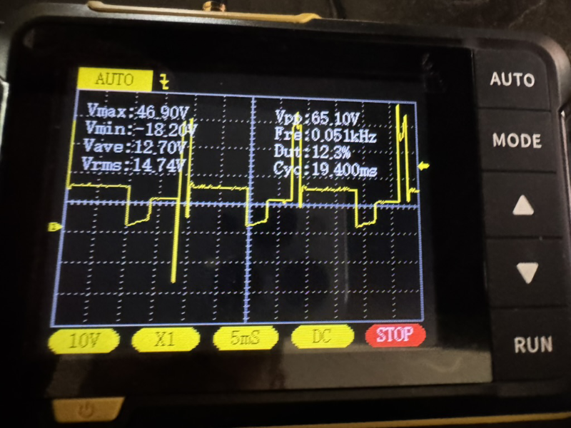
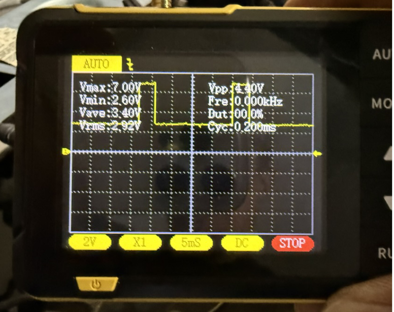

# Bronco II Controller

This contains code to add push button start to a 1990 Ford Bronco II.  It runs on a [M5Dial](https://shop.m5stack.com/products/m5stack-dial-esp32-s3-smart-rotary-knob-w-1-28-round-touch-screen?srsltid=AfmBOopNiyRXYXNu6qZNPGmPNzxHJgsR5VEo9MoOiuh-Q4pTg5F6bXE1) connected to a circuit to measure engine RPM and control the ignition, starter and accessories.

In brief the code:

1) Senses when both the clutch and M5Dial button are pressed 
1) activates the ignition circuit
1) engages the starter
1) watches engine RPM and disengages the starter once it reaches 400 RPM, or after 5 seconds maximum.
1) when the engine is detected as running, the accessories (A/C, radio etc) are powered on.
1) it then waits until the clutch and M5Dial button are both pressed for one second, and then deactivates the accessories and ignition

## Circuit details

The original idea for the circuit was a [reddit post](https://www.reddit.com/r/AskElectronics/comments/pznd3f/working_on_building_a_digital_tach_for_my_car_but/) which had broken images, but then found the circuit [here](https://github.com/seanauff/classic-car-sensor-interface/issues/2)

The circuit turns raw ignition pulses | into cleaned up square waveforms
:-------------------------:|:-------------------------:
|  |  |

However power consumption was a bit high at 120mA when the relays were added so I implemented deep sleep along with a master relay to only power the sensors once the ESP was awake.  That dropped parasitic draw to a more manageable 1.2mA

## Future

Eventually I intend to connect the dial to the [carplay head unit](https://www.amazon.com/gp/product/B0CQJPXDWN) to control the volume.  I'd also like to connect to bluetooth and interface with the door locks, but that will likely incur an unacceptable high power draw.

